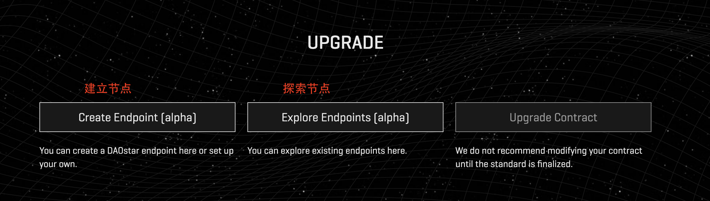
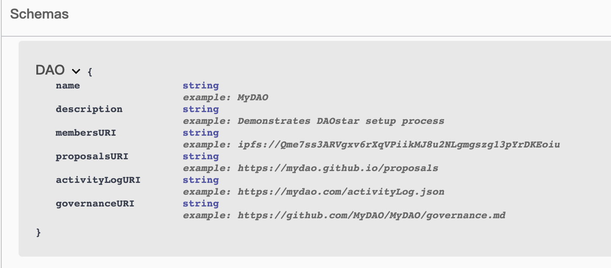
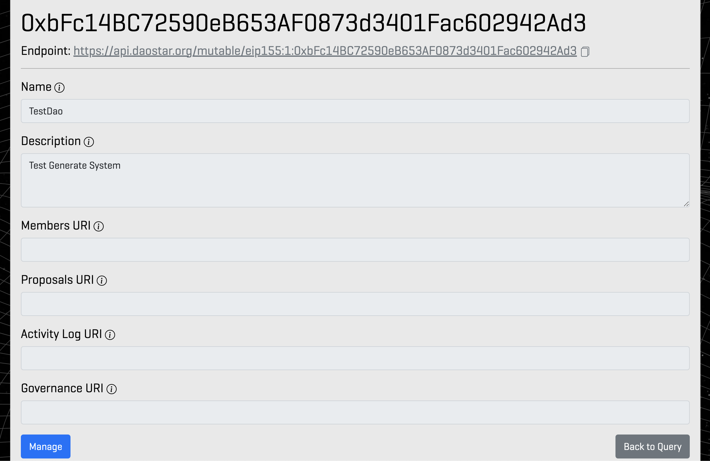

# EIP-4824 DAOs 的共通街口

**EIP-4824: Common Interfaces for DAOs**

## **Abstract**

一个针对分散式自治组织(DAOs) 的API标准，专注于关连链上和链下会员和提案。

## **Motivation**

Dao 自从被以太访白皮书使用以来，都是模糊定义的。这导致了广泛的模式，但很少标准化，標準化和户操作性是支持各种的必须
**制定 DaoURI 也参考类是 EIP-721的 tokenURI 的标准增强发现性、易读性、提议模拟和工具之间的相互操作性。**整个生态系统更一致的数据也是未来 Dao 标准的先决条件。

## **规格**

EIP-4824 不是一个程式实作上吃重的协议，而是在结构上的制定，所以分两块解说 代码、 Url 資料格式

如果不想往下看可以直接看 [网页](https://daostar.org/schemas/)
### **代码**

代码实现上如下

```javascript
pragma solidity ^0.8.1;

interface EIP4824 {
    function daoURI() external view returns (string _daoURI);
}
```

如上设定一个 DaoURL 就没了，daoURL 这部份在后面资料结构说明。

如何使用？一个 DAO 可以继承上面的接口或者它可以创建一个符合这个 EIP 的外部注册合约。外部注册合约必须存储 DAO 的主地址。

```javascript
pragma solidity ^0.8.1;

/// @title EIP-4824 Common Interfaces for DAOs
/// @dev See <https://eips.ethereum.org/EIPS/eip-4824>

error NotOwner();
error NotOffered();

contract EIP4824Registration is EIP4824 {
    string private _daoURI;
    address daoAddress;

    event NewURI(string daoURI);

    constructor() {
        daoAddress = address(0xdead);
    }

    function initialize(address _daoAddress, string memory daoURI_) external {
        if (daoAddress != address(0)) revert AlreadyInitialized(); // 设定初始化
        daoAddress = _daoAddress;
        _daoURI = daoURI_; // 章程初始
    }
    // 设定
    function setURI(string memory daoURI_) external {
        if (msg.sender != daoAddress) revert NotOwner();
        _daoURI = daoURI_;
        emit NewURI(daoURI_);
    }

    function daoURI() external view returns (string memory daoURI_) {
        return _daoURI;
    }
}

```
目前正在讨论中的变更有
    Offer offer     求职者
    address manager 管理者

[正在讨论议程](https://daostar.one/EIP)

如果 DAO 使用外部注册合约，DAO 应该使用通用注册工厂合约来启用高效的网络索引。
[可参考链上](https://etherscan.io/address/0x4acd31edc93adb1cf08ffbcf4097bd61f4a824f6#code)

大致明白后来看比较重要的结构部分
### **结构**
#### **DaoURI 的 JSON-ID Schema(主)**
```javascript
{
    "@context": "http://www.daostar.org/schemas",
    "type": "DAO",
    "name": "<name of the DAO>",      // DAO 的名称
    "description": "<description>",   // 描述
    "membersURI": "<URI>",            // 成员URI
    "proposalsURI": "<URI>",          // 提案URI
    "activityLogURI": "<URI>",        // 活动日志URI
    "governanceURI": "<URI>"          // 治理URI
}
```
- #### **Members （成员）[membersURI]的 JSON-ID Schema**
> DAO 成员对象数组。成员对象可以包括与特定 DAO 成员资格概念相关的任何相关属性。一个简单成员对象的示例将包含一个属性，即以太坊地址。

```javascript
{
    "@context": "<http://www.daostar.org/schemas>",
    "type": "DAO",
    "name": "<name of the DAO>",  // DAO 的名称
    "members": [ // 成员
        {
            "type": "EthereumAddress", // 可以是 EthereumAddress, DID, ENS, CAIP10Address
            "id": "<address or other identifier>" // 可以是 0x.... or rory.eth 造上面标签即可
        },
        {
            "type": "EthereumAddress",
            "id": "<address or other identifier>"
        }
    ]
}
```
这个格式是可变动的，他们期望不同的 DAO 可以使用不同的方式扩展<br>
毕竟每个 DAO 取得成员资格差异很大，也有可能有权线上的差异或所有权，而这样的制定是为了权衡一些链上功能以获得更大的灵活性和效率。<br>
主要制作团队也是期望提供此格式将链上及链下数据文化作个组合及基本统一格式上作扩充<br>


#### **Proposals （提案）[proposalsURI]的 JSON-ID Schema**
> DAO 提案对象数组。提案对象必须包含提案架构中描述的 ID 属性。此外还可以包括与提案的特定 DAO 概念相关的任何相关属性。
这里特别说到希望链上提案编号需要统一的格式（唯一性）  **CAIP10_ADDRESS + “?proposalId=” + PROPOSAL_COUNTER**
链下提案可以使用类似的 id 格式，其中 CAIP10_ADDRESS 被替换为适当的 URI 或 URL

[CAIP-10 格式](https://github.com/ChainAgnostic/CAIPs/blob/master/CAIPs/caip-10.md)

```javascript
{
    "@context": "http://www.daostar.org/schemas",
    "type": "DAO",
    "name": "<name of the DAO>", // DAO 名称
    "proposals": [ // 提案
        {
            "type": "proposal",
            "id": "<proposal ID>", // 提案id
            "name": "<name or title of proposal>", // 提案名称
            "contentURI": "<URI to content or discussion>", // 可以用链下平台 URL Discourse、Discord 、Snapshot ...
            "status": "<status of proposal>", // 提案状态可自定 ex:['Null', 'Staking', 'Submit', 'Reveal', 'Closed', 'Finalizable', 'Finalized', 'Failed']
            "calls": [ // 呼叫的方法(执行)
                {
                    "type": "CallDataEVM",
                    "operation": "<call or delegate call>",
                    "from": "<EthereumAddress>",
                    "to": "<EthereumAddress>",
                    "value": "<value>",
                    "data": "<call data>"
                }
            ]
        }
    ]
}
```

提案已成为 DAO 成员触发链上操作的标准方式，**例如发送代币作为授权的一部分或在外部合约中执行任意代码。**
然而，在实践中，许多 DAO 由 Discourse、Discord 或 Snapshot 等平台上的链下决策系统管理。
在这些平台上，链下提案可能充当管理员的信号机制或作为以后上线的先决条件-连锁投票。
（需要明确的是，链上投票也可以作为非绑定信号机制或作为导致某种链下执行的“绑定”信号。）我们提出的模式旨在支持链上和链下。

- #### **Activity Log (活动) [activityLogURI] 的 JSON-ID Schema**
> 活动日志 JSON 旨在捕获 DAO 成员与给定提案之间的相互作用。活动示例包括创建/提交提案、对提案进行投票、对提案提出异议等。

```javascript
{
    "@context": "<http://www.daostar.org/schemas>",
    "type": "DAO",
    "name": "<name of the DAO>",
    "activities": [
        {
            "id": "<activity ID>", // 活动
            "type": "activity",
            "proposal": { // 提案
                "id": "<proposal ID>", // 与提案ID 榜定
                "type": "proposal"
            },
            "member": { // 成员
                "type": "EthereumAddress",
                "id": "<address or other identifier>"
            }
        }, 
    ],
    "activities": [
        {
            "id": "<activity ID>",
            "type": "activity",
            "proposal": {
                "id": "<proposal ID>",
                "type": "proposal"
            },
            "member": {
                "type": "EthereumAddress",
                "id": "<address or other identifier>"
            }
        }
    ]
}
```

后续讨论提案：历史、互动


- #### **governanceURI (治理 url）**


这里没有强迫的格式，下列为一些解释

选择“治理”这个词作为一个合适的词，反映 <br>
(1) 这个词在 DAO 生态系统中的广泛使用 <br>
(2) 在开源软件项目中发布 governance.md 文件的常见做法。<br>

感觉上是宪章的概念。

考虑的替代名称：描述、自述文件、宪法

## ** daostar 实作接口**

首先就上叙 Daostar  作了简易接口可以沟通可以参考下列网址
[swagger](https://daostar.org/api/docs/#/)

### ***API 说明：**

`POST /mutable`
> creates a new mutable DAO endpoint （建立新的可变动端点）

`GET /mutable/{caip}`
> returns DAO schema  (回传 DAO 格式)

`PUT /mutable/{caip}`
> updates DAO schema (更新 DAO 格式)

`DELETE /mutable/{caip}`
> deletes a DAO schema endpoint（删除可变动端点）

`POST /immutable`
> new immutable DAO endpoint (建立新的不变动端点)

`GET /immutable/{cid}`
> returns DAO schema (回传 DAO 格式)

PS. 目前还不清楚可变动与固定之差别

### ***实际操作截图：**
- 画面说明


- 建立节点
https://daostar.org/api/create


格式在预设的提示都有，这边也截图请求格式


- 建立完后有属于 DAO 所属 URL



可以去看看[前往](https://api.daostar.org/mutable/eip155:1:0xbFc14BC72590eB653AF0873d3401Fac602942Ad3)


附上 api 程式 (https://github.com/metagov/daostar-api)