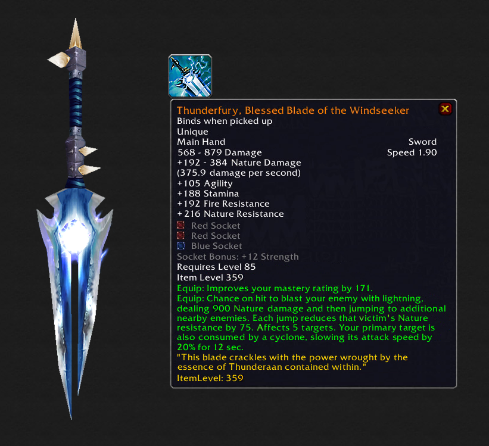
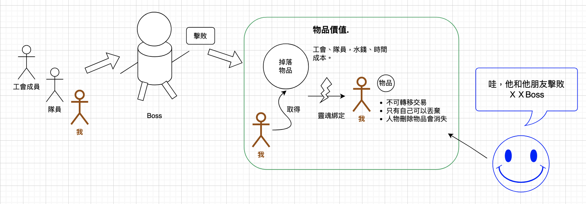
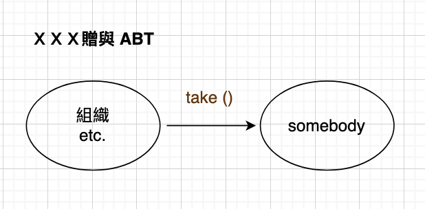
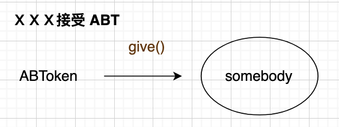
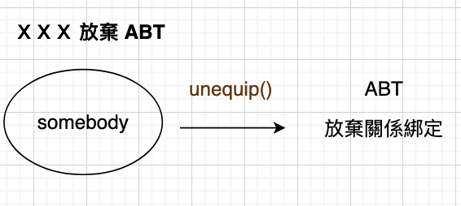

# EIP-4973 帳戶綁定代幣

**EIP-4973: Account-bound Tokens**

CCIP：Cross-Chain Interoperability Protocol


[EIP英文](https://eips.ethereum.org/EIPS/eip-4973)

### **背景**：

即魔獸世界的遊戲設計者故意將一些物品從世界拍賣行市場系統中取出以防止它們具有公開發現的價格並限制其可訪問性。

今日主角是它


### **说明**：
Vanilla WoW 的“雷霆之怒，逐风者的祝福之刃”就是这样的传奇物品，它需要 40 人的团队副本，以及其他子任务，才能杀死火焰领主“拉格纳罗斯”以获得“火焰领主的精华”，一个**制作一次剑**所需的材料。

在制作后，这把剑永久地与角色的“灵魂”**绑定**，使得玩家角色之间**无法交易、出售甚至交换它**。

也就是说这把剑的价值是由参与副本的所有人（工会）所组成，下次大家看到这把剑就知道 

“哇ˊ～～这工会或这个人有杀死这火焰领主（拉格纳罗斯）”

而这物品会如何消失呢？拥有者如果想**丢弃**或**人物被删除时**

图例：


有上叙的理解来看协议如何制定

- 设计上参考市场广泛使用的 EIP-721 代币协议 → 但因为不可以转让所以不能实作 `transferFrom`
所以 ERC721Metadata 结构(如下），方便现行 NFT 平台 呈现。

```solidity

constructor(name, symbol)
name()
symbol()
tokenURI(tokenId)
_setTokenURI(tokenId, _tokenURI)
_setBaseURI(baseURI)
baseURI()
_burn(owner, tokenId)
```

- 实作三个function

```solidity

/// 从帐户中删除 `uint256 tokenId`。在任何时候，一个
/// ABT 接收者必须能够将自己与 ABT 解除关联
unequip(uint256 tokenId)

//创建并转移 ABT 的所有权(赠送）
function give(
    address to,
    string calldata uri,
    bytes calldata signature
  )
///创建并转移 ABT 的所有权（接受）
function take(
    address from,
    string calldata uri,
    bytes calldata signature
  )

```

所以場景就會變成這樣

- Take()

- give()

- unequip()

