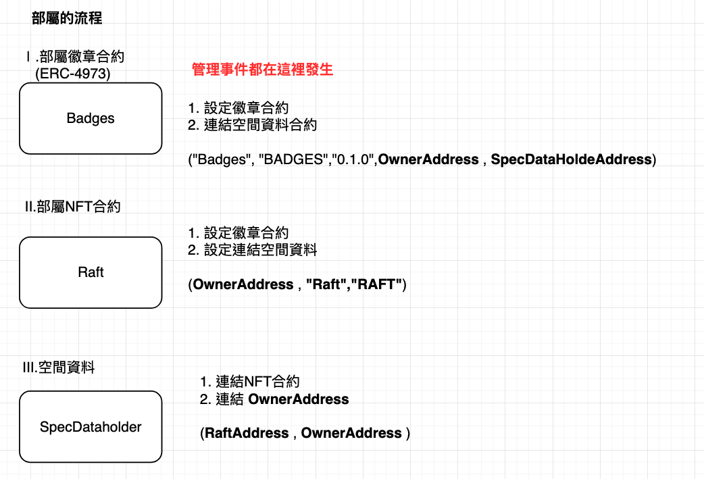
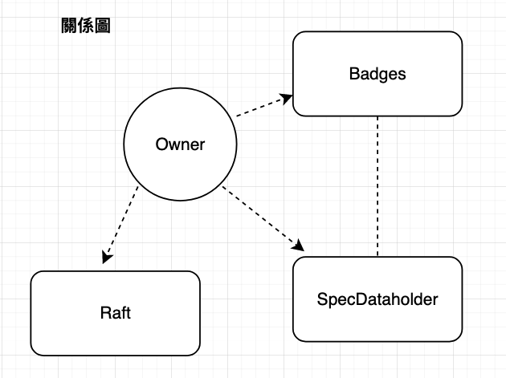
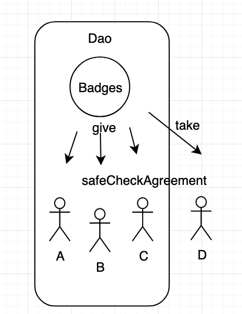
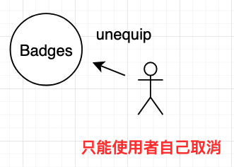

# EIP-4973 帳戶綁定代幣

**EIP-4973: Account-bound Tokens**

CCIP：Cross-Chain Interoperability Protocol


[EIP英文](https://eips.ethereum.org/EIPS/eip-4973)

### **背景**
<hr>
即魔兽世界的游戏设计者故意将一些物品从世界拍卖行市场系统中取出以防止它们具有公开发现的价格并限制其可访问性。

今日主角是它


### **说明**：
<hr>
Vanilla WoW 的“雷霆之怒，逐风者的祝福之刃”就是这样的传奇物品，它需要 40 人的团队副本，以及其他子任务，才能杀死火焰领主“拉格纳罗斯”以获得“火焰领主的精华”，一个**制作一次剑**所需的材料。

在制作后，这把剑永久地与角色的“灵魂”**绑定**，使得玩家角色之间**无法交易、出售甚至交换它**。

也就是说这把剑的价值是由参与副本的所有人（工会）所组成，下次大家看到这把剑就知道 

“哇ˊ～～这工会或这个人有杀死这火焰领主（拉格纳罗斯）”

而这物品会如何消失呢？拥有者如果想**丢弃**或**人物被删除时**

图例：


有上叙的理解来看协议如何制定

- 设计上参考市场广泛使用的 EIP-721 代币协议 → 但因为不可以转让所以不能实作 `transferFrom`
所以 ERC721Metadata 结构(如下），方便现行 NFT 平台 呈现。

```solidity

constructor(name, symbol)
name()
symbol()
tokenURI(tokenId)
_setTokenURI(tokenId, _tokenURI)
_setBaseURI(baseURI)
baseURI()
_burn(owner, tokenId)
```

- 实作三个function

```solidity

/// 从帐户中删除 `uint256 tokenId`。在任何时候，一个
/// ABT 接收者必须能够将自己与 ABT 解除关联
unequip(uint256 tokenId)

//创建并转移 ABT 的所有权(赠送）
function give(
    address to,
    string calldata uri,
    bytes calldata signature
  )
///创建并转移 ABT 的所有权（接受）
function take(
    address from,
    string calldata uri,
    bytes calldata signature
  )

```

所以場景就會變成這樣

- Take()


- give()


- unequip()


<br>
<br>

## **案例** : [otterspace](https://otterspace.xyz/)
<hr>


先简单介绍Otterspace这个项目：

DAO領導人可以設置他們的DAO，創建徽章（EIP-4973不可轉讓的代幣）並將其分發到地址。
為了避免非自願鑄造，Otterspace協議要求收件人自己認領並鑄造徽章，空投在這裡是不存在的。
Otterspace是在Optimism L2鏈上，所產生的交易成本是比较低的。


首先我们要先设定场場景会有三種人

- An individual human member (an Otter) 個人
- A group of individuals acting in concert (a romp of Otters) 群組
    - A squad or sub-DAO
    - The DAO itself
- Benevolent community bots 友善的机器人

我们开始吧！！首先先看一下部属方式和关系


关系如下：


- 如何變成子群


1. 取得Raft NFT
2. createSpec(string memory _specUri, uint256 _raftTokenId)

    createSpec 設定子區

    1. 會先判定是否是NFT持有者
    2. 確定子區是否存在
    3. 設定資料於 specDataHolder _specToRaft 鏈上資料

3. 使用 give 給成員
    1. 先取得nftid 是否存在
    2. 確認是不是允許發送的擁有者
    3. 確定safeCheckAgreement 憑證
    4. mint 發放 nft 給成員(順便寫鏈上訊息）

- 個人放棄徽章



使用 unequip

1. 會先確認這個這個徽章是不是這個人的
2. 確定後unset+burn 鏈上資料

另外有幾個比較特殊的function

1. senderIsRaftOwner 撤銷客戶徽章（被設定的owner)
    
    這邊只設定鏈上資料，不會真的把nft burn掉
    
    有以下幾個原因
    
    - 原因 0：濫用
    - 原因 1：離開社區
    - 原因 2：任期結束
    - 原因 3：其他
2. reinstateBadge 為用戶恢復徽章
    
    也是去改鏈上資料
